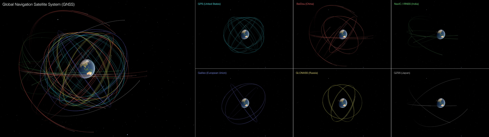
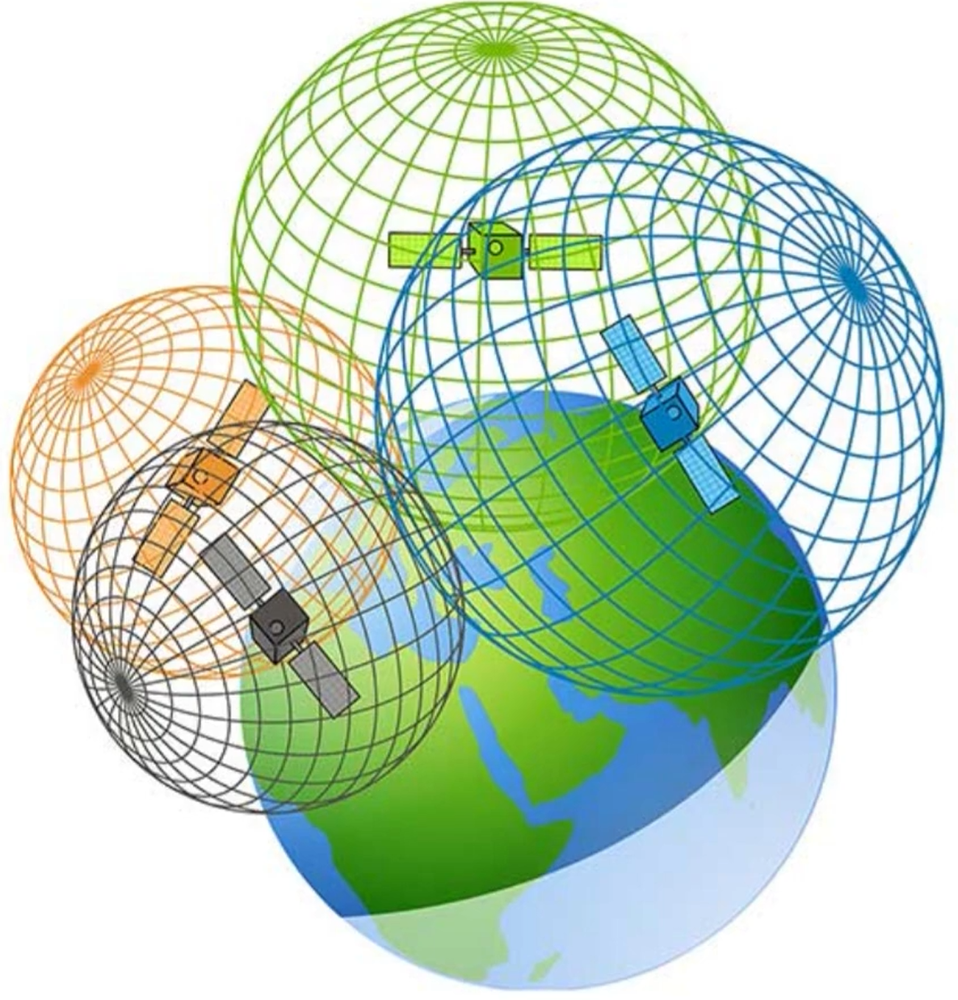
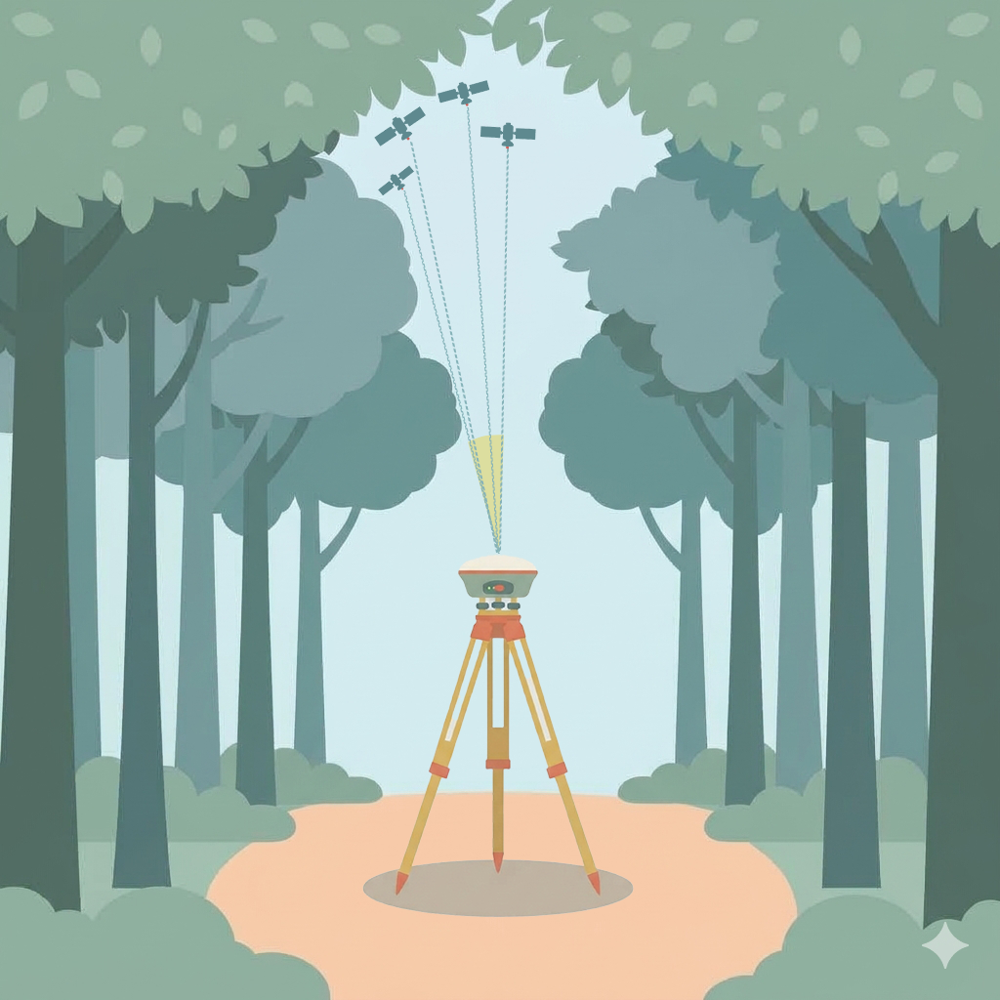
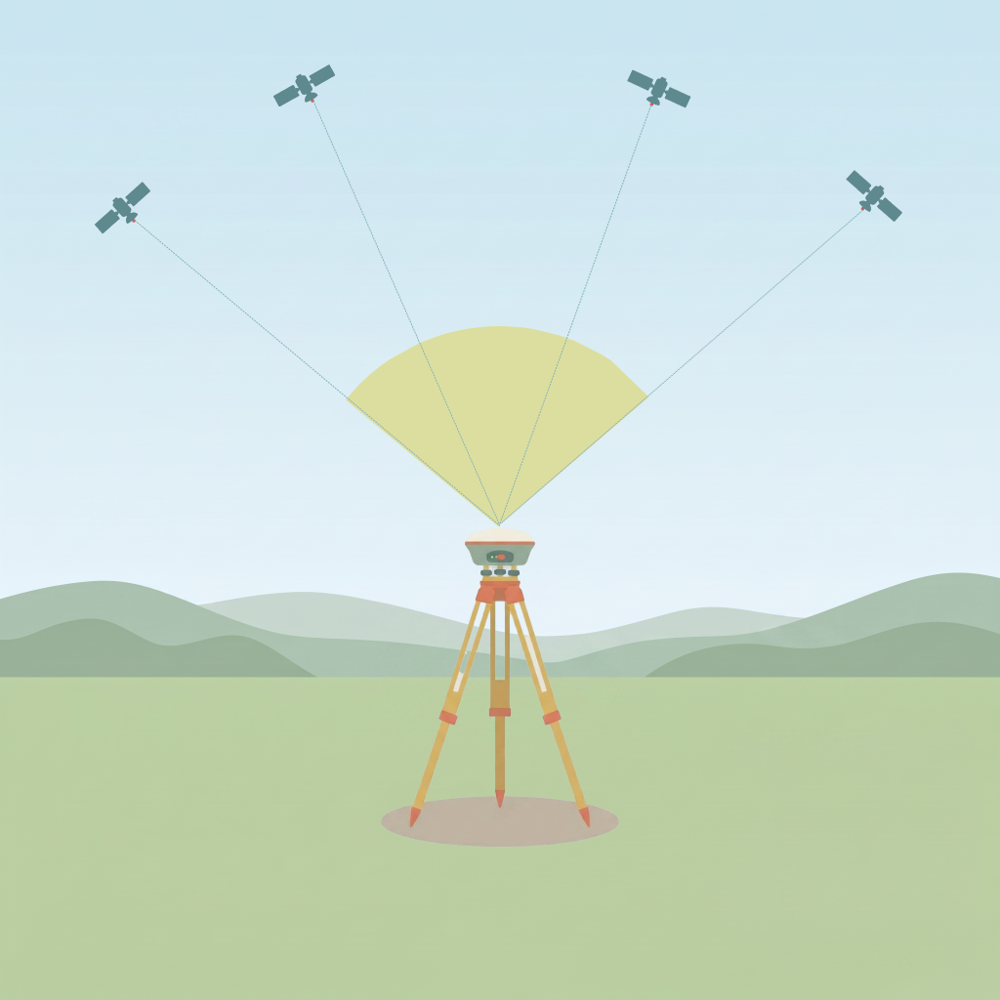

#  Module 1 — GNSS

*Read time: 7–10 minutes*

**By the end of this module, you can:** judge whether your satellite
situation is good enough to trust a point — by count *and* geometry —
read and interpret your controller's DOP numbers, and explain why a high
satellite count alone can still mislead you.

## 1.1 GNSS Constellations

GNSS (Global Navigation Satellite System) is the umbrella term for all
satellite positioning systems — GPS is just one of them. Several
independent constellations exist, each run by a different country or
region:

| **Constellation** | **Operated by** | **Global or regional** | **~Satellites** |
| --- | --- | --- | --- |
| GPS | United States | Global | 31 |
| GLONASS | Russia | Global | 24 |
| Galileo | European Union | Global | 28 |
| BeiDou | China | Global | 44 |
| QZSS | Japan | Regional | 7 |
| NavIC | India | Regional | 8 |

*Counts above are each constellation's total satellites — not how many
are visible above your horizon at once. In the open, a modern
multi-constellation receiver typically sees 8–20+ at once, combining
several of these systems.*

A receiver limited to GPS-only sees only GPS satellites. Track GPS +
GLONASS + Galileo + BeiDou together, and you typically see 2–3× more
satellites at once — often the difference between a usable fix and no
fix under partial obstruction (tree cover, canyon walls, tall
buildings).

**Global vs. regional.** Global systems have satellites overhead
anywhere on Earth. **QZSS** (Japan) and **NavIC** (India) are regional:
they serve only their own area (Asia-Oceania for QZSS; India and about
1,500 km around it for NavIC). From the Northeast US they are below
the horizon, so they add nothing to your count, even if your receiver
lists them in its settings.


*Global Navigation Satellite System (GNSS) satellites, color-coded by operating country: United States (cyan), European Union (blue), China (red), Russia (yellow), India (green), and Japan (white). Composite view designed for ultrawide displays, including the NASA Earth Information Center (EIC). This version includes labels. See [video](https://svs.gsfc.nasa.gov/vis/a000000/a005600/a005627/gnss_EIC_comp_labels_3840x1080_60fps_60mbps_h265_01.mp4)*.</br>

*Source: NASA Scientific Visualization Studio: https://svs.gsfc.nasa.gov/5627/*

| **WHY IT MATTERS** | |
|---|---|
| Confirm multi-constellation tracking is turned on in your receiver settings. Don't leave it limited to GPS-only. | |

## 1.2 SBAS: Corrections, Not Extra Satellites

You'll also see **SBAS** (Satellite-Based Augmentation System) on your
device. WAAS is the version used in North America. SBAS is not another
constellation, and it adds no satellites to your count. It is a
correction layer built on top of GPS: ground stations measure GPS
errors and send corrections up to geostationary satellites, which
broadcast them back down on the same kind of signal your receiver
already listens for. The corrections are free, work automatically on
most receivers, and only apply while your receiver is tracking GPS.

| | **GPS (standalone)** | **GPS + WAAS** |
|---|---|---|
| **What it is** | Satellite constellation that provides your position | Correction layer added on top of GPS |
| **Average accuracy** | ~2-10 m | ~1-3 m |
| **Coverage** | Worldwide | North America (continental U.S., Alaska, Canada, parts of Mexico) |
| **Cost / setup** | Free, built in | Free, usually automatic |
| **Adds satellites to your count?** | Yes | No |

WAAS is still meter-level, well short of the 1–3 cm needed for survey
work. Centimeters take the RTK, PPK, or PPP methods covered in later
modules.

Don't mix SBAS up with QZSS and NavIC in 1.1. Those are regional
*constellations* that fix positions. SBAS satellites only send
corrections.

## 1.3 How Your Receiver Finds a Position: Trilateration

Your receiver times each satellite's signal, converts that timing into
a distance, then combines distances from several satellites to
pinpoint your location. This is called **trilateration**. One distance
draws a circle around a satellite; a second distance draws another
circle, crossing the first at two points; a third distance passes
through only one of those two points — leaving a single answer.


*The three steps of trilateration: (1) the receiver times each satellite's signal, (2) it converts that time into a distance, and (3) it combines the distances. A third satellite's circle passes through only one of the two points where the first two circles cross.*

**Why trilateration needs 4 satellites, not 3.**
<div style="float: right; margin-left: 15px; text-align: center; width: 200px;" markdown="block">

<!--

<p class="image-credit">Source: Geospatial Solution</p>-->

</div>
Three circles only work if your receiver's clock is perfect. It isn't: its cheap clock
error shifts every distance by the same amount, so the circles miss
each other. A 4th satellite adds a 4th equation, so the receiver can
solve four unknowns at once: X, Y, Z (your 3D position) and its own
clock error. All satellites send the same kind of signal; none is "the
time satellite." Satellites beyond 4 let the receiver cross-check and
drop a degraded signal.</br>
<!--[How GPS Calculates Your Position | Trilateration Explained by Geospatial Solution [YouTube Video]](https://www.youtube-nocookie.com/embed/urLfpVSaBIs)
<br style="clear: both;">-->

<iframe width="560" height="315" src="https://www.youtube-nocookie.com/embed/urLfpVSaBIs?si=xeNW3Tv4yFznYftF" title="YouTube video player" frameborder="0" allow="accelerometer; autoplay; clipboard-write; encrypted-media; gyroscope; picture-in-picture; web-share" referrerpolicy="strict-origin-when-cross-origin" allowfullscreen></iframe>


## 1.4 Checking Your Geometry: Dilution of Precision (DOP)

Count tells you *how many* satellites you have. The next question is
*where they sit relative to each other* — that's geometry, and it's
just as important.

**Why does spread matter more than count?** Picture pointing at an
object with one finger from each hand, held far apart — your two
sightlines cross at a sharp angle, and it's easy to pinpoint the object
exactly. Now bring your hands close together and point at the same
object — the sightlines are nearly parallel, and a tiny shake in your
hand swings the crossing point a long way. Satellites spread across
the sky are like hands held far apart: small measurement errors barely
move your position. Satellites bunched in one part of the sky are like
hands held close together: the same small errors swing your position
around a lot.

| | |
| :---: | :---: |
|  |  |
| Poor DOP | Good DOP |


**What DOP tells you.** Your controller reports geometry as **DOP**
(Dilution of Precision). Think of it as a multiplier on your
measurement error: with a DOP of 1, position error is about the same as
the error in each satellite distance; with a DOP of 4, it is about four
times larger. **The lower the number, the better.**

**The DOP family.** DOP comes in several versions, each covering a
different part of the solution. They nest inside each other: **PDOP**
(3D position) splits into **HDOP** (horizontal) and **VDOP** (height);
HDOP is built from **EDOP** and **NDOP**; and **GDOP** adds time
(**TDOP**) on top of PDOP.

| **DOP** | **Name** | **What it measures** | **Watch it when** | **Why it matters** |
|---|---|---|---|---|
| **PDOP** | Position DOP | 3D position: latitude, longitude, and height | Default choice for most field work | Best single number for overall geometry |
| **HDOP** | Horizontal DOP | Position on the ground: latitude (north–south) and longitude (east–west) | You only need horizontal positions | Shows how well you can place a point on a map |
| **VDOP** | Vertical DOP | Height (up–down) | You need heights (see below) | Height is the weakest part of a fix, so this is usually the largest of the three |
| **GDOP** | Geometric DOP | 4D: 3D position + time | Rarely shown on field screens | The overall number, including the receiver clock; always the highest in the family |
| **TDOP** | Time DOP | Time (the receiver clock) | Rarely; just know it exists | Describes the clock part of the solution, not your position |
| **EDOP / NDOP** | East DOP / North DOP | East–west (longitude) and north–south (latitude) separately | Not needed in the field | Only building blocks for HDOP |


!!! tip
    **Heights take longer.** Every satellite is above the horizon, so
    nothing helps the fix from below, and height ends up the weakest
    direction. VDOP often runs about 1.5 to 2 times HDOP, and vertical
    accuracy is usually worse than horizontal. Expect to spend more time on
    points where height matters.

??? note "Optional: how the DOP numbers relate (the math)"

    The family combines like the sides of a right triangle:

    ```
    HDOP = √(EDOP² + NDOP²)
    PDOP = √(HDOP² + VDOP²)
    GDOP = √(PDOP² + TDOP²)
    ```

    Example, with EDOP 0.8, NDOP 0.7, VDOP 1.4, TDOP 0.9:

    ```
    HDOP² = EDOP² + NDOP² = 0.64 + 0.49 = 1.13  →  HDOP ≈ 1.06
    PDOP² = HDOP² + VDOP² = 1.13 + 1.96 = 3.09  →  PDOP ≈ 1.76
    GDOP² = PDOP² + TDOP² = 3.09 + 0.81 = 3.90  →  GDOP ≈ 1.97
    ```

    To turn DOP into an error estimate, multiply it by the error in
    each satellite distance. If that error is about 3 m, an HDOP of
    1.06 gives roughly 3.2 m horizontal error. At an HDOP of 3, the
    same 3 m gives about 9 m.

**Reading the number.** Use this table for PDOP, HDOP, or VDOP,
whichever your screen shows:

| **DOP** | **Rating** | **What it means** |
|---|---|---|
| Below 1 | 🟢 Ideal | Best possible geometry; rare in practice |
| 1 to 3 | 🟢 Very good | Trust it for any work |
| 3 to 5 | 🟢 Good | Fine for most work, including logging a point |
| 5 to 6 | 🟡 Acceptable | Usable, but at the limit; treat the point with caution |
| Above 6 | 🔴 Poor | Don't trust the reading |

These are general guidelines, and your project or equipment vendor may
set its own limit. For 1–3 cm work, aim for green.

!!! warning "Important"
    Six satellites bunched in one part of the sky can give a *worse* fix than four spread out. Check DOP or the sky plot before logging — not just the satellite count.

If your DOP stays high and won't improve, a later module (Hard Places)
covers what to actually do about it — move, wait, or switch methods.
This module is only about recognizing good geometry from bad; the fix
comes later.
<iframe width="560" height="315" src="https://www.youtube-nocookie.com/embed/CwDIiPXLTs4?si=qYpScwhTCpzAUDaW" title="YouTube video player" frameborder="0" allow="accelerometer; autoplay; clipboard-write; encrypted-media; gyroscope; picture-in-picture; web-share" referrerpolicy="strict-origin-when-cross-origin" allowfullscreen></iframe>
<!--[Dilution of Precision: Why Satellite Geometry Destroys Accuracy by GIS Resources](https://youtu.be/CwDIiPXLTs4?si=KBZfDO2WfIz-gHE8)-->

## 1.5 Where to Check It

[//]: # (VERIFY on devices: which DOP each app shows, and where; whether Zeno Mobile has a sky plot.)

| Question | What to look at |
|---|---|
| How many satellites? | Satellite count on your controller's position or satellites screen |
| Is the geometry good? | **PDOP** if your screen shows it — it covers full 3D position. Compare it to the color table in 1.4. |
| Which DOP should I watch? | PDOP for general work. HDOP if you only care about horizontal position. VDOP if heights matter. |
| My screen only shows HDOP and VDOP | Use the higher of the two as a quick check. Your PDOP is at least that high. |
| Where are GDOP, TDOP, EDOP, and NDOP? | Often not shown on field screens. You don't need them; PDOP, HDOP, and VDOP cover field decisions. |
| No DOP on this screen | Look for a **sky plot** on the satellites screen, or check your app's Help. Satellites spread around the sky are good; bunched on one side is poor. |

### Self-Check

Pick the best answer for each question. The explanation opens after you
choose. If one is a miss, that's the concept to revisit.

<div class="self-check" markdown>

<div class="sc-card" data-answer="a" markdown>
**Q1. Which four are global constellations?**

<ul class="sc-options">
  <li data-key="a">a. GPS, GLONASS, Galileo, BeiDou</li>
  <li data-key="b">b. GPS, QZSS, NavIC, Galileo</li>
  <li data-key="c">c. GPS, GLONASS, WAAS, BeiDou</li>
  <li data-key="d">d. QZSS, NavIC, WAAS, GLONASS</li>
</ul>

<div class="sc-explain" markdown>
WAAS is a correction system, and QZSS and NavIC are regional.
</div>
</div>

<div class="sc-card" data-answer="c" markdown>
**Q2. What does WAAS do?**

<ul class="sc-options">
  <li data-key="a">a. Adds satellites to your count</li>
  <li data-key="b">b. Replaces GPS in North America</li>
  <li data-key="c">c. Corrects GPS errors, giving about 1–3 m accuracy</li>
  <li data-key="d">d. Gives 1–3 cm accuracy on its own</li>
</ul>

<div class="sc-explain" markdown>
WAAS is a correction layer on GPS. It adds no satellites.
</div>
</div>

<div class="sc-card" data-answer="b" markdown>
**Q3. What is the minimum number of satellites for a position fix, and why?**

<ul class="sc-options">
  <li data-key="a">a. 3, because three circles cross at one point</li>
  <li data-key="b">b. 4, because the 4th solves the receiver's clock error</li>
  <li data-key="c">c. 4, because the 4th is a dedicated time satellite</li>
  <li data-key="d">d. 5, so the receiver can cross-check</li>
</ul>

<div class="sc-explain" markdown>
Solving X, Y, Z plus clock error takes 4 satellites.
</div>
</div>

<div class="sc-card" data-answer="d" markdown>
**Q4. Which statement about DOP is correct?**

<ul class="sc-options">
  <li data-key="a">a. Higher DOP means better geometry</li>
  <li data-key="b">b. DOP counts the satellites you track</li>
  <li data-key="c">c. DOP measures signal strength</li>
  <li data-key="d">d. Lower DOP means better geometry</li>
</ul>

<div class="sc-explain" markdown>
DOP (Dilution of Precision) rates geometry; lower is better.
</div>
</div>

<div class="sc-card" data-answer="a" markdown>
**Q5. Your PDOP reads 4. What is the rating color?**

<ul class="sc-options">
  <li data-key="a">a. 🟢 Green</li>
  <li data-key="b">b. 🟡 Yellow</li>
  <li data-key="c">c. 🔴 Red</li>
</ul>

<div class="sc-explain" markdown>
3 to 5 is 🟢 Good.
</div>
</div>

<div class="sc-card" data-answer="b" markdown>
**Q6. Which DOP covers full 3D position, and which covers horizontal position only?**

<ul class="sc-options">
  <li data-key="a">a. HDOP for 3D, PDOP for horizontal</li>
  <li data-key="b">b. PDOP for 3D, HDOP for horizontal</li>
  <li data-key="c">c. GDOP for 3D, VDOP for horizontal</li>
  <li data-key="d">d. VDOP for 3D, PDOP for horizontal</li>
</ul>

<div class="sc-explain" markdown>
PDOP is 3D position; HDOP is horizontal only.
</div>
</div>

</div>
